# Paper Trail - save/load manager

A save manager for **Schedule I** that looks and feels like part of the game. It keeps a paper trail of your
campaign: rolling auto-saves, a snapshot of every save, and backups of each slot, so a bad deal, a lost fight, a
broken mod or a new game started in the wrong slot never costs you hours of play.

Schedule I gives you one save per slot. Save again and the old one is gone; start a new game in a slot and the
campaign that was there is gone. Paper Trail keeps every save you make, lets you load any of them from the main
menu or the pause menu, and backs a slot up before anything replaces what is in it.

- **Needs:** [MelonLoader](https://github.com/LavaGang/MelonLoader) 0.7.x, on the game's default (IL2CPP) branch.
- **Optional:** [Mod Manager & Phone App](https://www.nexusmods.com/schedule1/mods/397), to change the settings in game.
- **Download:** [releases](https://github.com/r-melvin/Melange/releases?q=paper-trail) (tagged `paper-trail-v*`).

## What it does

### Saves you never asked for, at moments that matter

- **Rolling auto-save** every 2 in-game hours, keeping the last 10. It waits for a safe moment: not mid-deal,
  mid-fight, or while the game is already saving.
- **Key-moment saves** when a quest is completed, a dealer is recruited, a property or business is bought, you
  rank up, the cartel situation changes, or a new area or supplier is unlocked. (Customer unlocked is off by
  default: it happens too often.)
- **Every save you make is kept** as its own snapshot, up to 30 per campaign, and pinned saves are never pushed out.
- **Follows the game's 60-second save wait** after a save-point save or a load.

### Load any save, from the main menu or a game

| The game | With Paper Trail |
|---|---|
| 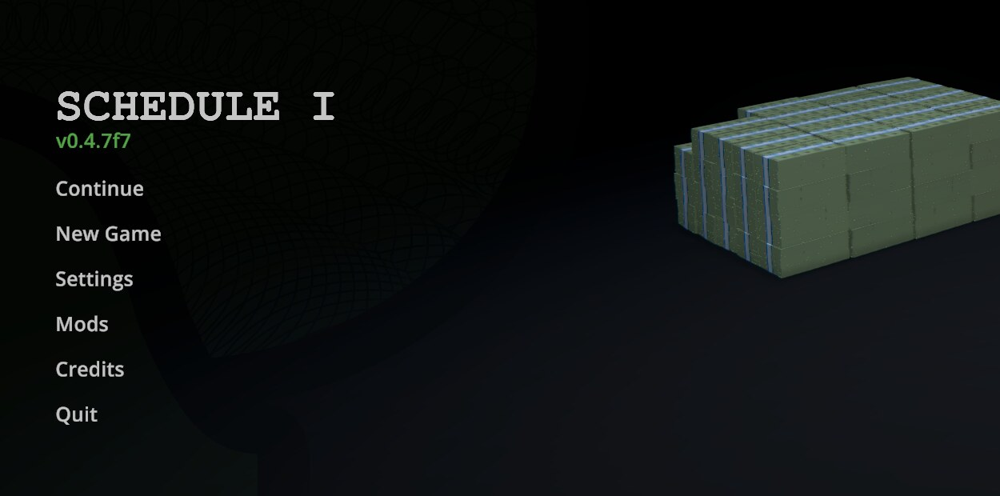 | 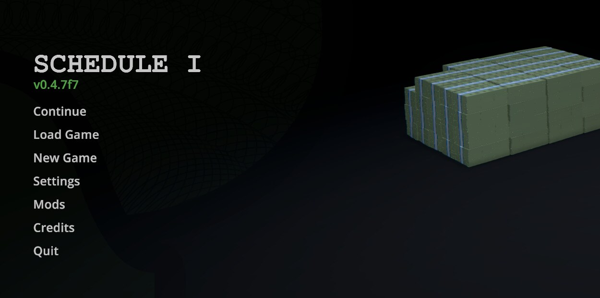 |
| *Continue* opens the slot list. | *Continue* loads your last played save straight away. *Load Game*, below it, opens the load screen. |
| 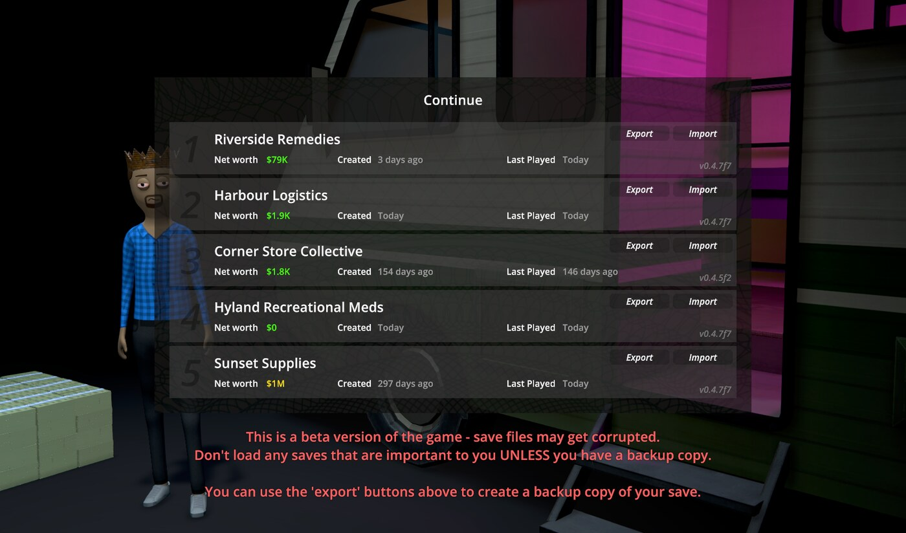 | 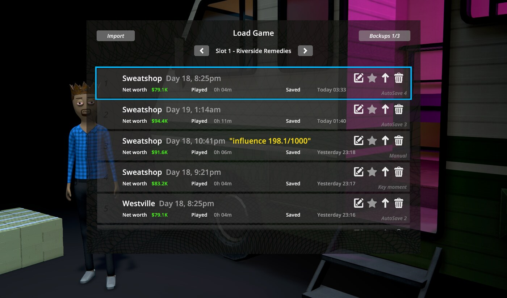 |
| One save per slot. | Every save of the slot's campaign, newest first. `<` and `>` switch slots. Click a save to load it. |

Each save shows where you were, the in-game day and time, net worth, play time and when it was saved, with icons
to **rename** it (add a note such as "before the RV blew up"), **pin** it so it is never pushed out, **export** it
as a zip, or **delete** it. *Import* (top left) adds a save file to the slot's list; nothing is replaced until you
load it. Exported saves are in the game's own export layout, so the game's *Import* takes them too.

### Save and load from the pause menu

| The game | With Paper Trail |
|---|---|
| 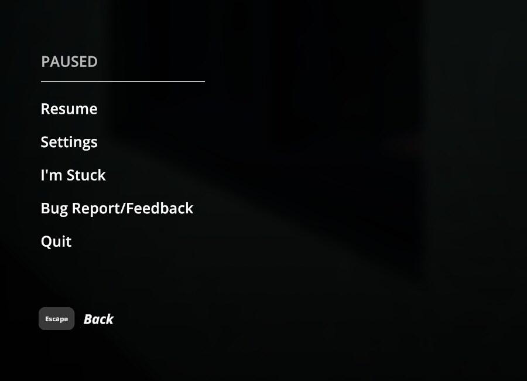 | 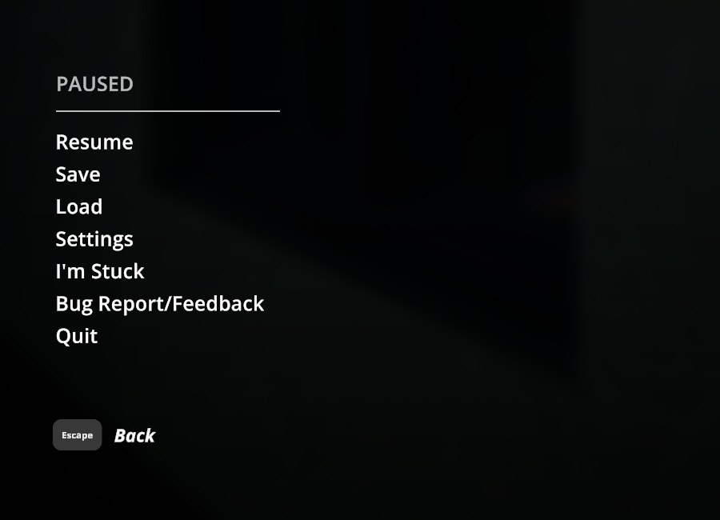 |

| Save | Rename | Load |
|---|---|---|
| 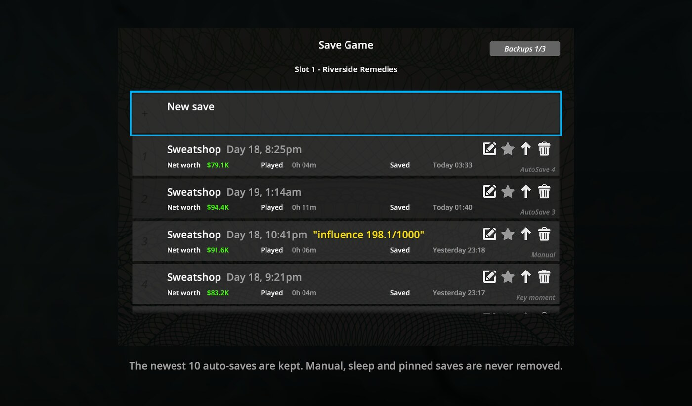 | 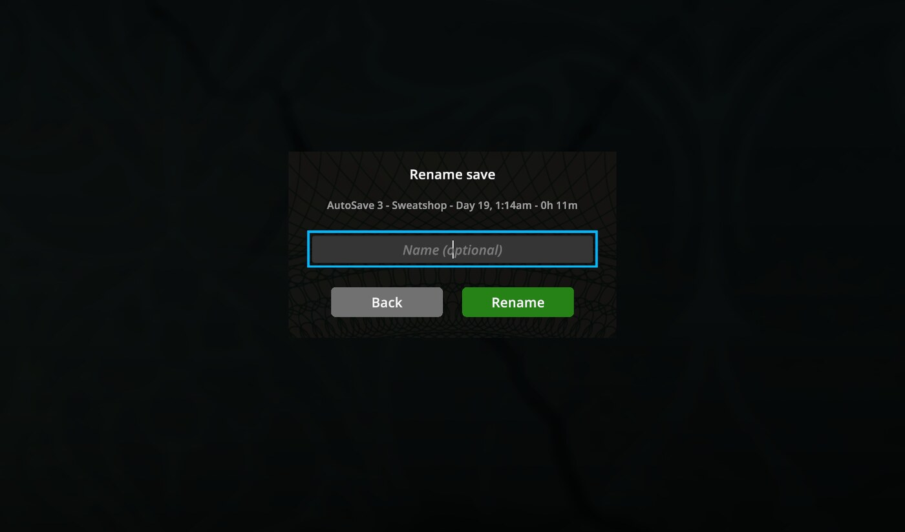 | 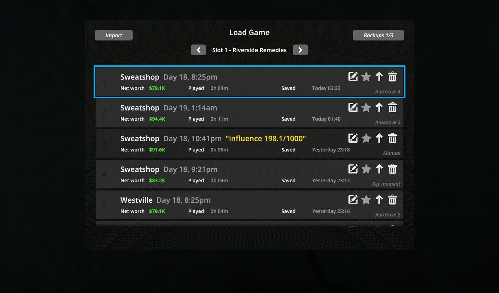 |
| Save as a new snapshot, or overwrite one. | Every save can carry a note. | Load any save of any campaign without quitting to the menu. It asks first, since anything since your last save is lost. |

The screens are built from the game's own panels, buttons and icons, and behave like its menus: Escape goes back,
and there is no extra close button. The safehouse *Intercom Save Point* opens the save screen too.

### Backups of each slot

| A slot's backups | A full slot |
|---|---|
| 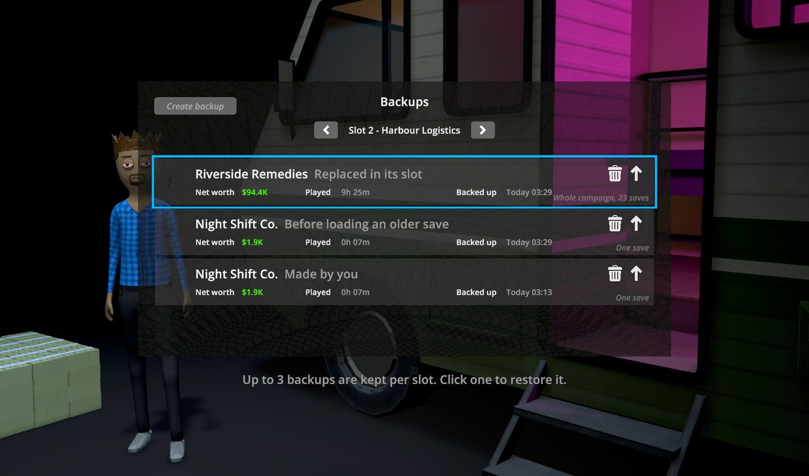 | 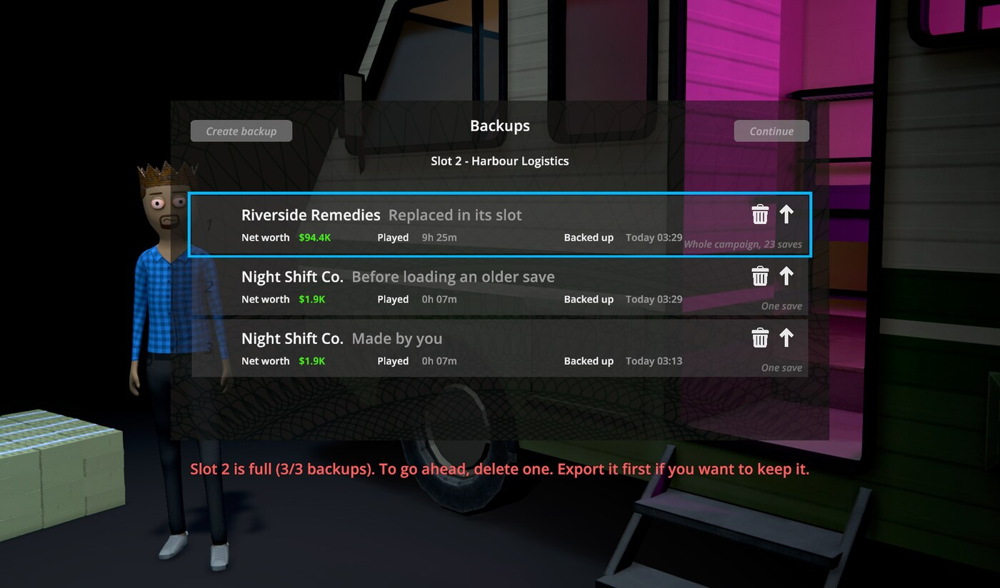 |

Each slot keeps up to 3 backups (1 to 10 in the settings). A backup is made, and a short notice says so:

- before **New Game** or the game's **Import** replaces the campaign in a slot (the whole campaign, every save);
- before **loading an older save** replaces the slot's current one, if Paper Trail does not already have it;
- whenever you press **Create backup**.

*Backups n/3* (top right of the load screen) opens them. Click a backup to restore it: it swaps places with what
is in the slot, so nothing is lost. When a slot already has all its backups and something is about to replace it,
the backups open first: delete one (export it first if you want to keep it), then *Continue* goes ahead.

### Safeguards

- A **safeguard copy** is kept before a save is loaded into a newer game version, or with a changed mod list.
- Each snapshot is **checked for looking incomplete** (far fewer or smaller files than the one before it); a
  suspect one is marked and never allowed to push older saves out.
- Holding **Shift** while the game starts skips *Continue last game on start-up*.

### Steam Cloud, and light on the game

Snapshots are worked on locally and mirrored to a folder Steam Cloud syncs, so they follow you between computers
(turn it off with *Sync snapshots with Steam Cloud*). Copying, zipping and syncing run on a low-priority
background thread.

## Installing

1. Install [MelonLoader](https://github.com/LavaGang/MelonLoader) 0.7.x and run the game once.
2. Put `PaperTrail.dll` in the game's `Mods` folder.
3. Optional: install [Mod Manager & Phone App](https://www.nexusmods.com/schedule1/mods/397) to change the
   settings in game.

To remove it, delete `PaperTrail.dll`. Your saves are untouched and your snapshots stay where they are.

## Settings

In the Mod Manager phone app under **PaperTrail**, or in `UserData/MelonPreferences.cfg`:

| Setting | Default |
|---|---|
| Continue last game on start-up | off |
| Auto-save, every (in-game hours), auto-saves kept per campaign | on, 2, 10 |
| Each key-moment save, key-moment saves kept per campaign | on (customer unlocked off), 30 |
| Manual saves kept per campaign | 30 |
| Backups kept per slot | 3 |
| Safeguard copies kept per campaign | 10 |
| Keep a copy before a game update, or when your mods have changed | on, on |
| Sync snapshots with Steam Cloud | on |

## Your saves without the mod

Every snapshot is a standard zip in the game's own export layout (`SaveGame_N/...`), so removing Paper Trail
loses nothing:

- snapshots: `UserData/PaperTrail/Snapshots/Slot_N/<snapshot>/save.zip`
- backups: `UserData/PaperTrail/Snapshots/Backups/Slot_N/<backup>/`
- the Steam Cloud mirror of both: `Saves/<SteamID>/PaperTrail/`

To use one without the mod, use the game's **Import** on the zip, or unzip it over the save folder yourself.

## Credits and prior art

- [MelonLoader](https://github.com/LavaGang/MelonLoader) and [HarmonyX](https://github.com/BepInEx/HarmonyX),
  which every Schedule I mod stands on.
- Prowiler's [Mod Manager & Phone App](https://www.nexusmods.com/schedule1/mods/397) shows Paper Trail's settings in game.
- Save mods for Schedule I that came first and showed what players wanted: [More Save Backups](https://www.nexusmods.com/schedule1/mods/2410) by Ultroman the
  Tacoman, [Automatic Backups](https://www.nexusmods.com/schedule1/mods/1168) by coderTrevor,
  [Plan B - Save Backup Mod](https://www.nexusmods.com/schedule1/mods/626) and
  [Autosave](https://www.nexusmods.com/schedule1/mods/861). Paper Trail shares no code with them.
- TVGS, for Schedule I, and for the save export format and the menu pieces Paper Trail is built from.

## Contributing

Bug reports and pull requests are welcome: see [CONTRIBUTING.md](../CONTRIBUTING.md). Please attach
`MelonLoader/Latest.log`, and don't attach a save unless asked.

## Licence

MIT - see [LICENSE](../LICENSE).
